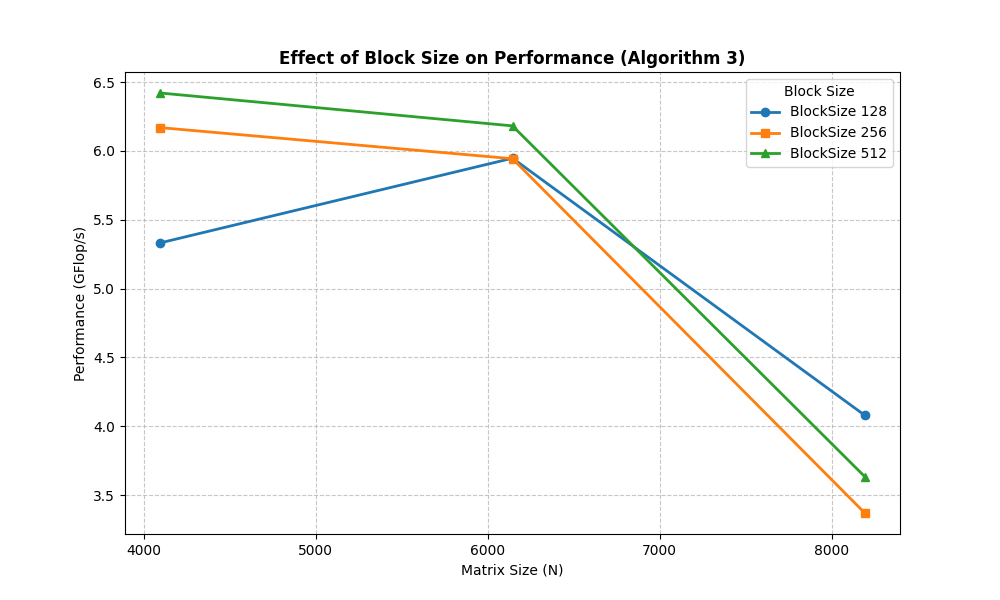
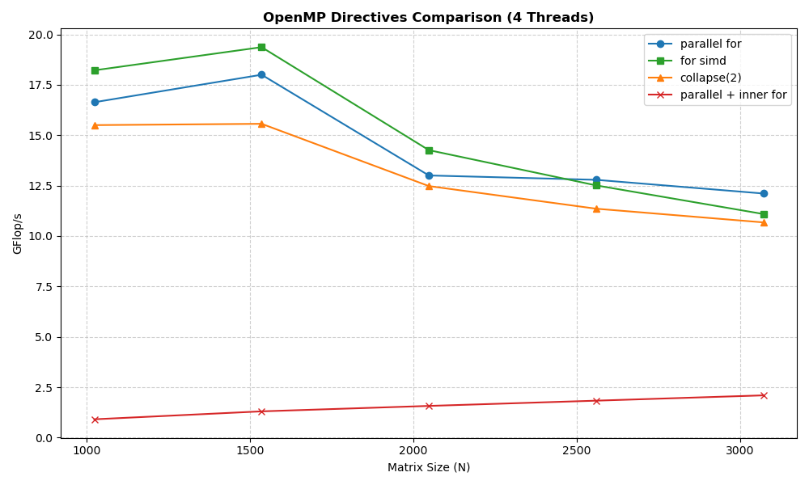

# CPD Project 1 - Matrix Multiplication Performance Analysis

This project studies the effect of the memory hierarchy on processor performance when accessing large amounts of data. Matrix multiplication is used as the benchmark, with implementations in C++ and Go.

## Project Structure

| Section | Description | Details |
|---------|-------------|---------|
| [Part 1.1-1.2: Sequential Algorithms](#part-1-single-core-performance) | Column vs Line multiplication in C++ and Go | [linear_graphs/README.md](./doc/linear_graphs/README.md) |
| [Part 1.3: Block Algorithm](#13-block-algorithm) | Cache-optimized block multiplication | [block_graphs/README.md](./doc/block_graphs/README.md) |
| [Perf Analysis](#perf-counter-analysis) | Hardware counter measurements | [perf_graphs/README.md](./doc/perf_graphs/README.md) |
| [Part 2: Parallel Implementation](#part-2-multi-core-performance) | OpenMP parallelization | [parallel_graphs/README.md](./doc/parallel_graphs/README.md) |

---

## Part 1: Single-Core Performance

### 1.1-1.2 Sequential Algorithms

We have implemented two matrix multiplication algorithms in C++ and Go:

- **Algorithm 1 (ijk)**: Multiplies one line of the first matrix by each column of the second matrix.
- **Algorithm 2 (ikj)**: Multiplies an element from the first matrix by the corresponding line of the second matrix.

**Key Findings:**

- Algorithm 2 (ikj) achieves **6-10x higher throughput** than Algorithm 1 (ijk) due to sequential memory access patterns that benefits from spatial locality.
- C++ outperforms Go, with the performance gap widening for larger matrices.
- Both algorithms show decreasing GFlop/s as matrix size increases beyond cache capacity.

For detailed graphs and analysis, see [linear_graphs/README.md](./doc/linear_graphs/README.md).

### 1.3 Block Algorithm

The block algorithm divides matrices into sub-blocks that fit in cache, reducing main memory accesses. Tested with block sizes of 128, 256, and 512 on matrices from 4096x4096 to 10240x10240.

**Key Findings:**

- Larger block sizes generally perform better by reducing loop overhead and maximizing cache utilization.
- Performance degrades if block size exceeds cache capacity.

For detailed graphs and analysis, see [block_graphs/README.md](./doc/block_graphs/README.md).

### Perf Counter Analysis

Using Linux `perf`, we measured CPU cycles and cache behavior (L1, L2, L3 hits/misses) for all three algorithms.

**Key Findings:**

- Algorithm 1 (ijk) has significantly higher L1/L2 cache miss rates due to column-wise access of matrix B.
- Algorithm 2 (ikj) improves cache performance through row-wise sequential access.
- Block algorithm achieves the lowest miss rates by keeping working data within cache.

For detailed graphs and analysis, see [perf_graphs/README.md](./doc/perf_graphs/README.md).

---

## Part 2: Multi-Core Performance

### 2.1 Parallel Algorithm Comparison

We parallelized both algorithms using OpenMP with 4 threads, testing two parallelization strategies:

- `#pragma omp parallel for` on the outer loop
- `#pragma omp parallel` with `#pragma omp for` on the inner loop

**Key Findings:**
- Version 2 (ikj) maintains ~4x higher throughput than Version 1 (ijk), consistent with single-core results.
- Parallelizing the **outer loop** vastly outperforms parallelizing the **inner loop** for both versions.
- Inner loop parallelization causes massive overhead due to repeated thread creation/synchronization.

### 2.2 Scalability Analysis

Using Version 2 (ikj) on 8192x8192 matrices, we tested scalability from 4 to 24 threads.

**Key Findings:**

- Performance scales well up to 16 threads.
- Beyond 16 threads, gains diminish due to memory bandwidth saturation and synchronization overhead.
- Efficiency drops as thread count increases, indicating the system becomes memory-bound.

### 2.3 OpenMP Directives Comparison

We evaluated different OpenMP directives: `parallel for`, `for simd`, `collapse(2)`, and `parallel + inner for`.

**Key Findings:**

- `parallel for` and `for simd` perform best (15-19 GFlop/s).
- `collapse(2)` adds scheduling overhead with minimal benefit.
- `parallel + inner for` performs extremely bad due to repeated thread synchronization.
