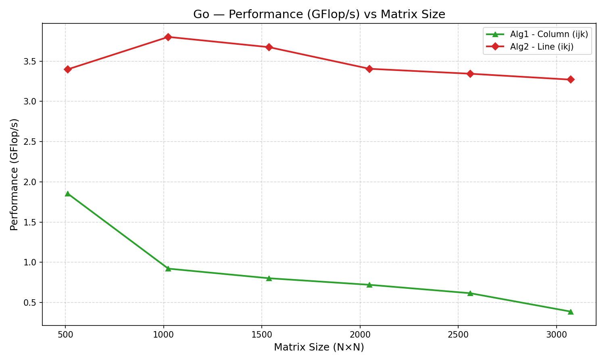
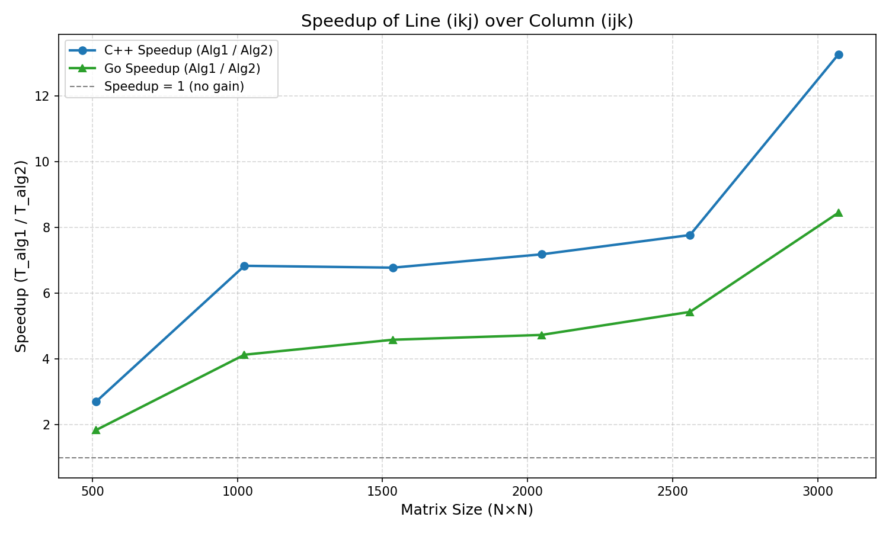
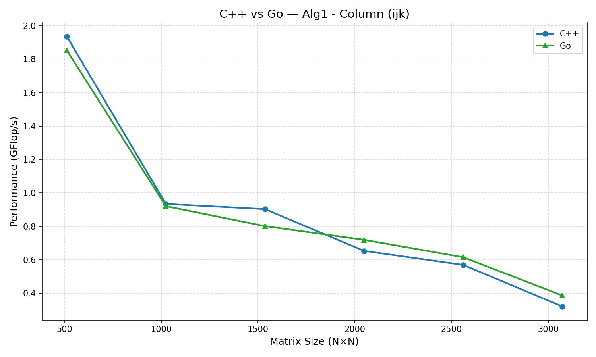
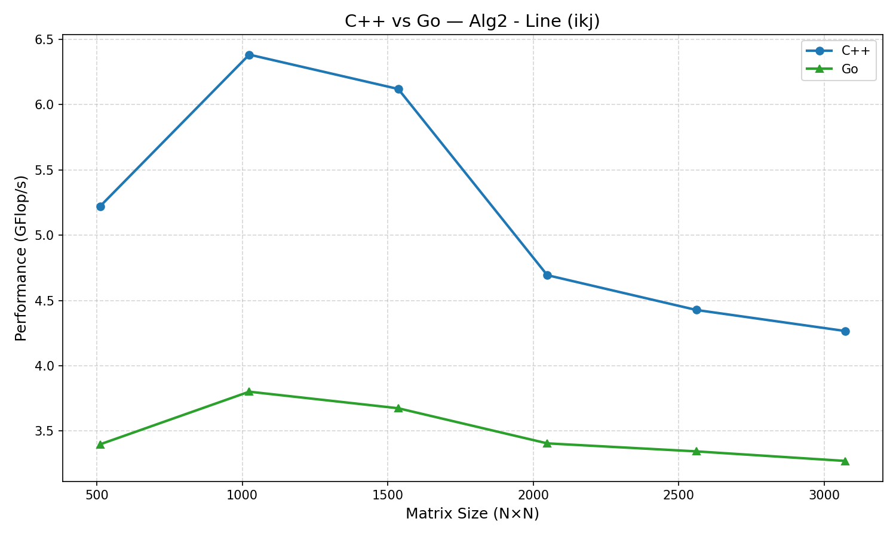

# Graphs for linear algorithms

## Introduction

This document contains graphs visualizing the execution time of different algorithms for matrix multiplication.

To measure the execution time, we implemented two sequential algorithms in C++ and Go, and we used the `time` command to collect execution time data. After that, we calculated the GFlop/s (Giga Floating Point Operations per second) for each algorithm and language, which is a common metric for evaluating the performance of matrix multiplication algorithms. To compute GFlop/s, we used the formula:

```txt
GFlop/s = (2 * N^3) / Execution Time in seconds
```

One other important metric we calculated is the speedup of Algorithm 2 over Algorithm 1, which is computed as:

```txt
Speedup = Execution Time of Algorithm 1 / Execution Time of Algorithm 2
```

For each algorithm, we measured:

- Size,
- BlockSize,
- Time_Seconds

### Execution Time vs Matrix Size


### GFlop/s vs Matrix Size


### GFlop/s per Language




### Speedup of Algorithm1 vs Algorithm2



### C++ vs Go per Algorithm




