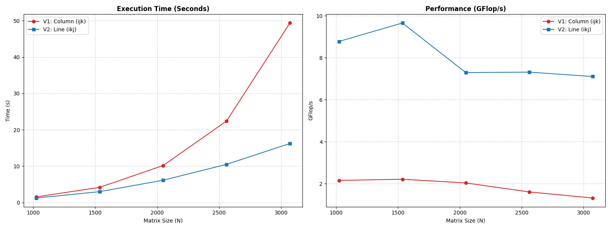
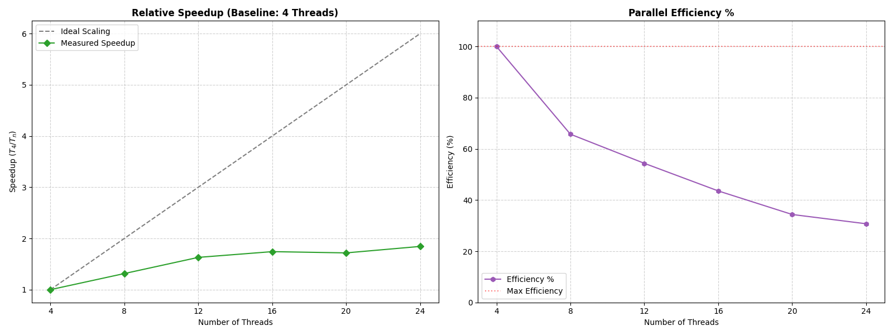

# Graphs for parallel algorithms

## Introduction 

This document analyzes the performance and scalability of matrix multiplication algorithms when parallelized using OpenMP. Following the requirements of the project, we evaluated how different memory access patterns affect multi-core execution and how the system scales from 4 to 24 threads.

The metrics were calculated using the following formulas:

```
GFlop/s = (2 * N^3) / Execution Time in seconds
```
```
Speedup = Execution Time (4 threads baseline) / Execution Time (p threads)
```
```
Efficiency = Speedup / (p/4)
```

### Algorithm Comparison

We compared two parallel implementations using 4 threads for matrix sizes ranging from 1024 to 3072.

- Version 1 (ijk): A column-based multiplication where the inner loop iterates over columns.

- Version 2 (ikj): A line-based multiplication where the inner loop iterates over rows.



#### Conclusions 
The data reveals a performance gap where **Version 2 (ikj)** consistently maintains a throughput nearly four times higher than **Version 1 (ijk)**. 

TIn Version 1 (ijk), the inner loop iterates over $j$, which corresponds to the columns of the second matrix. Because matrices are stored in row-major order, accessing the next column requires jumping across an entire row in memory. This pattern quickly exhausts the cache lines, leading to a high frequency of cache misses where the CPU must idle while waiting for data from the much slower RAM.

In contrast, Version 2 (ikj) reorders the loops so the inner loop iterates over $j$ while $k$ is fixed. This allows the algorithm to access the second matrix linearly. By reading contiguous memory addresses, the CPU can pre-fetch data into the L1/L2 caches effectively. Even with 4 threads competing for resources, Version 2's cache-friendly nature allows it to spend more cycles performing actual floating-point operations, resulting in the superior GFlop/s observed above.

## 2. Scalability Analysis

Using the more efficient **Version 2 (ikj)**, we evaluated the scaling behavior on a large **$8192 \times 8192$** matrix to observe how the system handles increased thread counts (4 to 24).



### Conclusions
The scalability results indicate that while increasing the thread count initially yields performance gains, the system encounters a significant **decrease beyond 16 threads**. 

As we increase the number of threads, we are not only increasing computational power but also the total pressure on the shared L3 cache and the memory controller. Once the 24 threads collectively demand more data than the memory bus can provide, the system becomes **memory-bound**. 

As seen in the Speedup graph, the widening gap between our **Measured Speedup** and the **Ideal Scaling** line suggests that the gains from parallelization are eventually offset by the overhead of thread synchronization and the hardware's inability to keep all cores saturated with data. At 24 threads, the "Efficiency" is at its lowest because the cores are spending a significant portion of their time stalled, waiting for the memory subsystem to fulfill data requests.