# Graphs for perf counters

## Introduction

This document contains graphs visualizing performance counter data for different algorithms.

For this type of project, we used `perf` command to collect performance counter data while executing the algorithms. We focused on CPU cycles and cache performance metrics, which are crucial for understanding the efficiency of the algorithms for heavy computations like matrix multiplication.

The three sequential algorithms implemented in this project access memory in different patterns:

- Algorithm 1 (Column, _ijk_): accesses matrix B column-by-column, causing frequent cache misses.
- Algorithm 2 (Row, _ikj_): accesses matrix B row-by-row, improving spatial locality and reducing cache misses.
- Algorithm 3 (Block): divides the matrices into blocks that fit in cache, optimizing spatial locality and further reducing cache misses.

For each algorithm, we measured:

- Size;
- BlockSize;
- cpu-cycles;
- mem_load_retired.l1_miss;
- mem_load_retired.l1_hit;
- mem_load_retired.l2_miss;
- mem_load_retired.l2_hit;
- mem_load_retired.l3_miss;
- mem_load_retired.l3_hit

### Counter vs Matrix Size

All algorithms on the same graph for each counter.

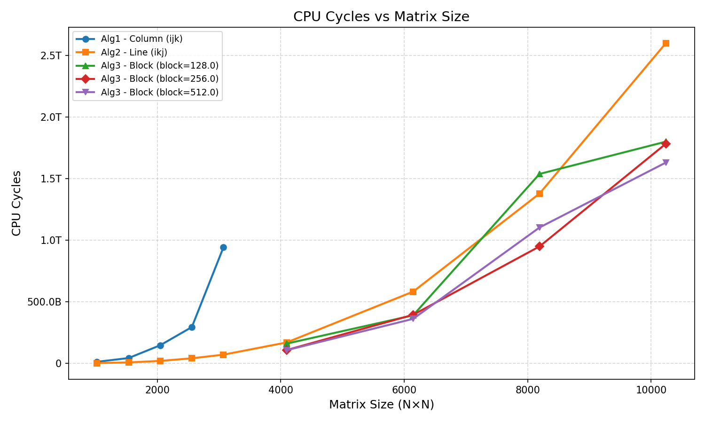

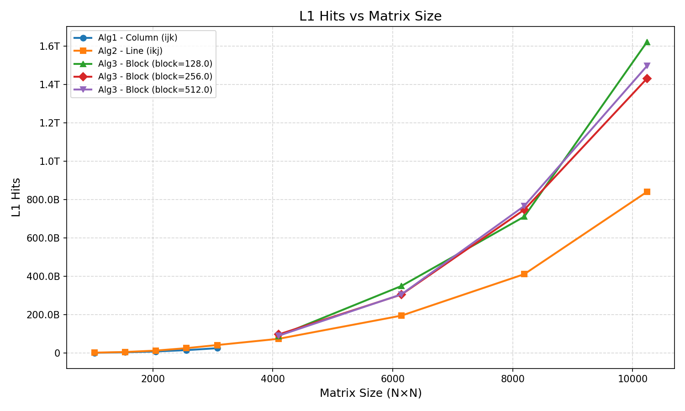

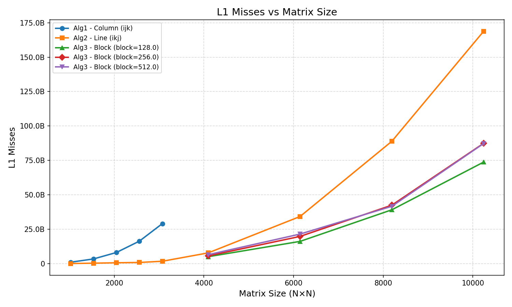

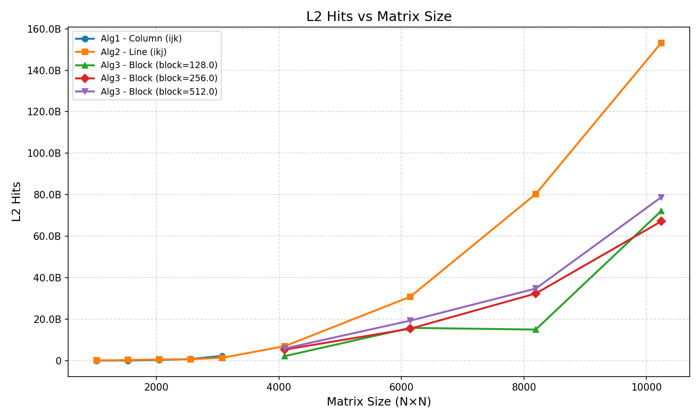

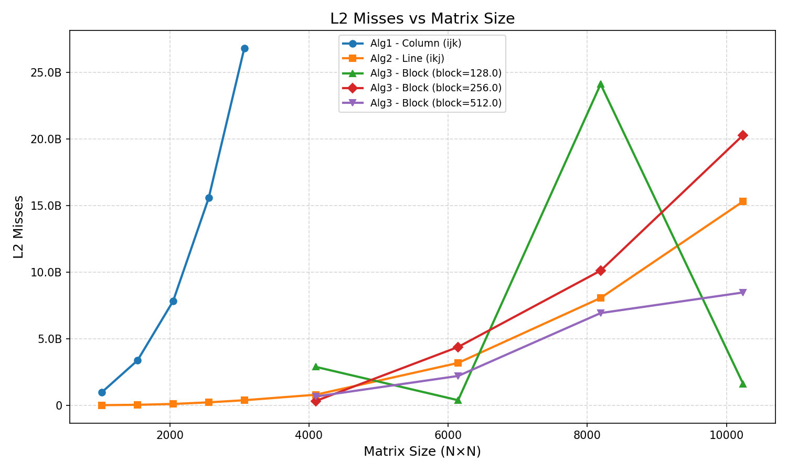

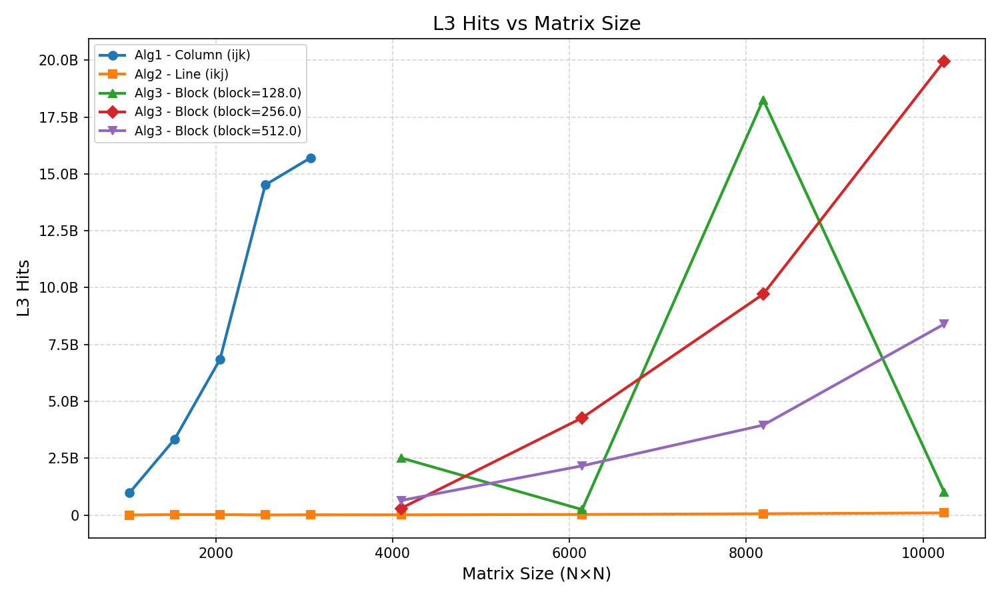

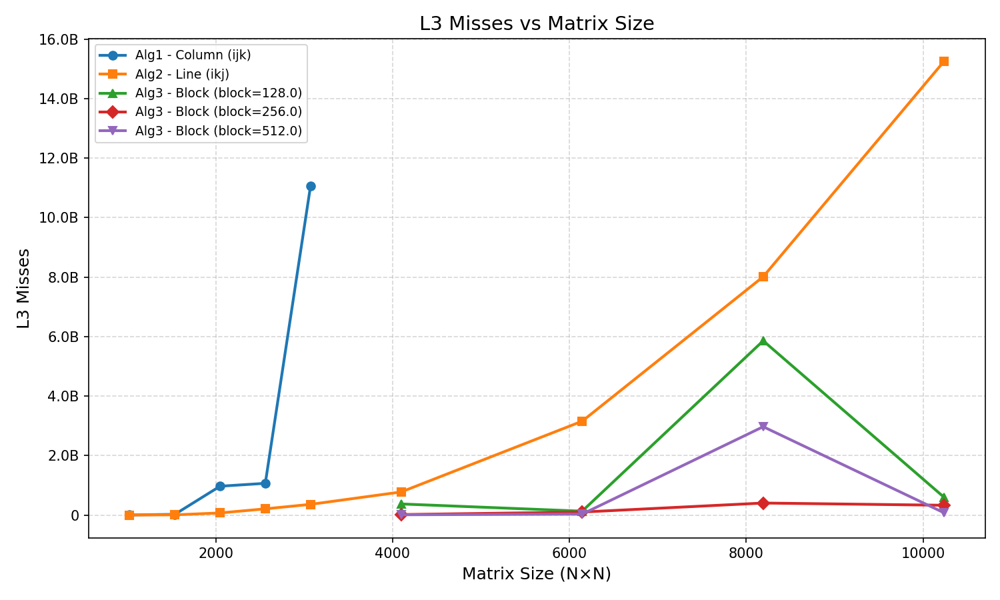

### Cache Miss Rate (%) vs Matrix Size

Computes `misses / (misses + hits) * 100` for each cache level.

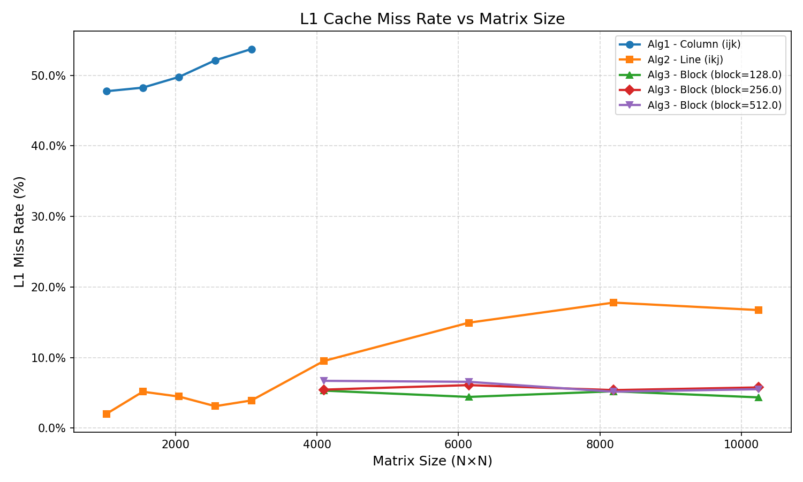

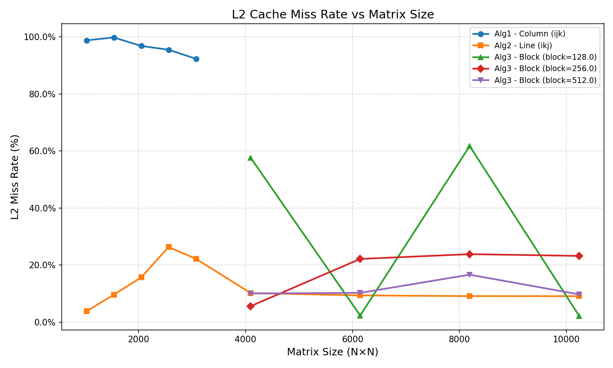

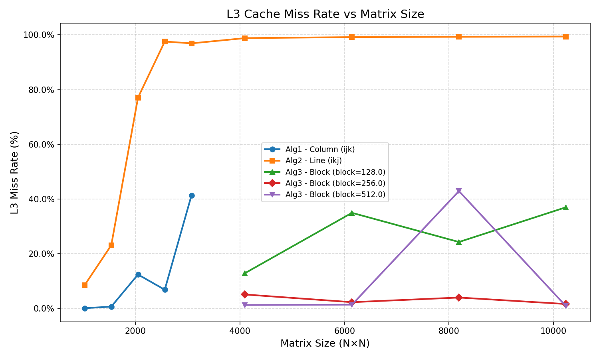

## Cache Misses per Cache Level

These graphs are bar charts for L1, L2, and L3 cache misses for each algorithm. This way we can compare the relative weight of each cache level's misses for each algorithm.

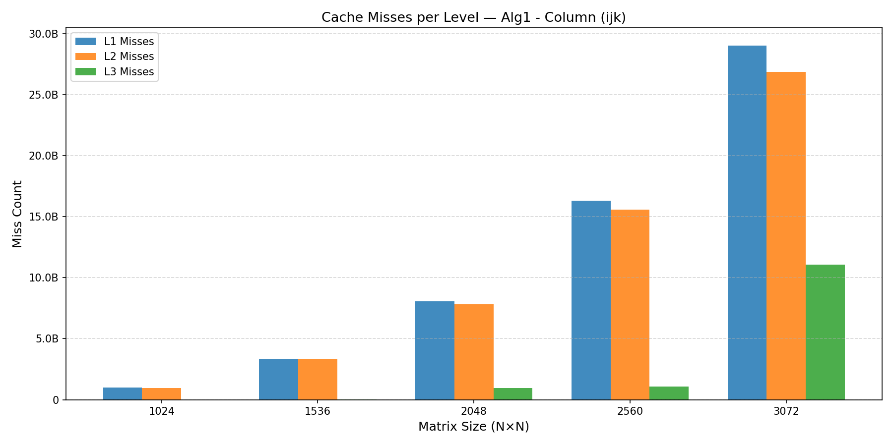

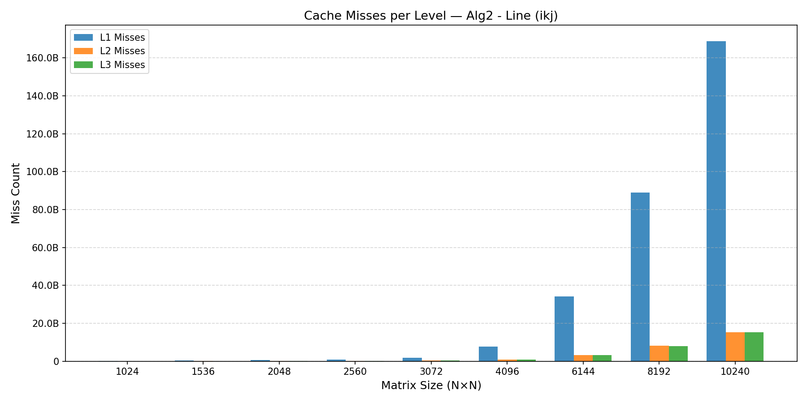

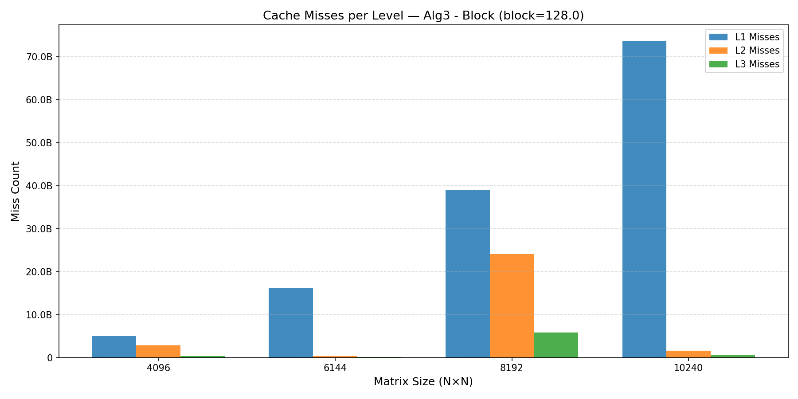

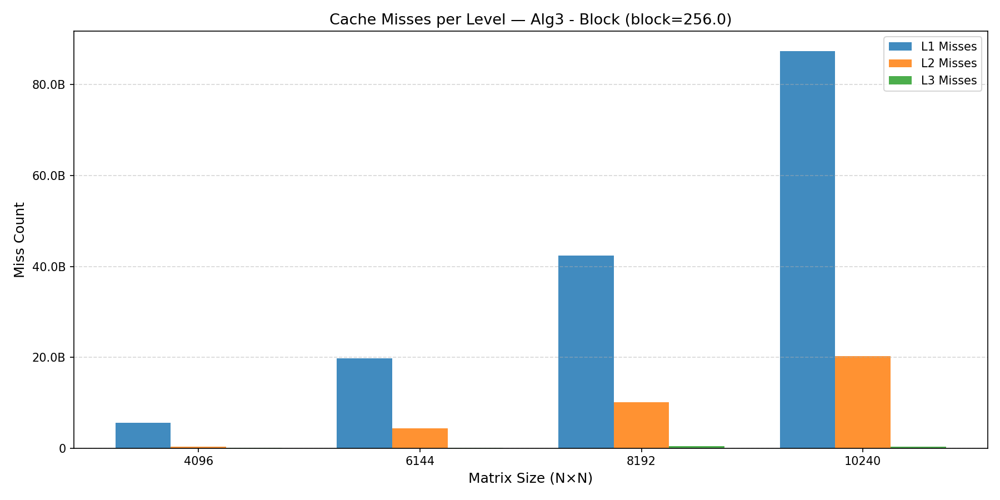

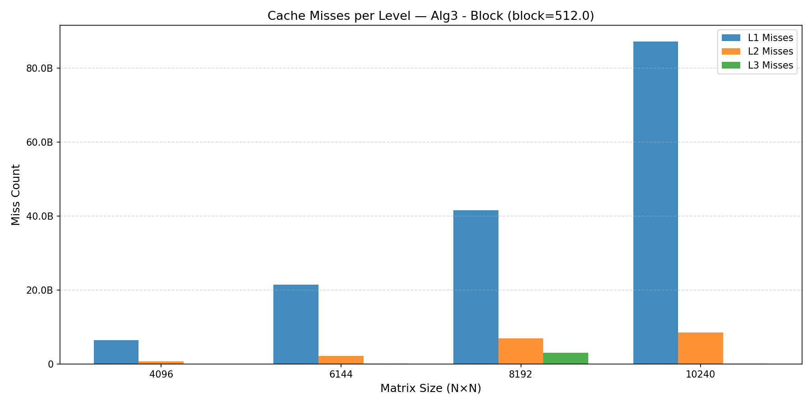
