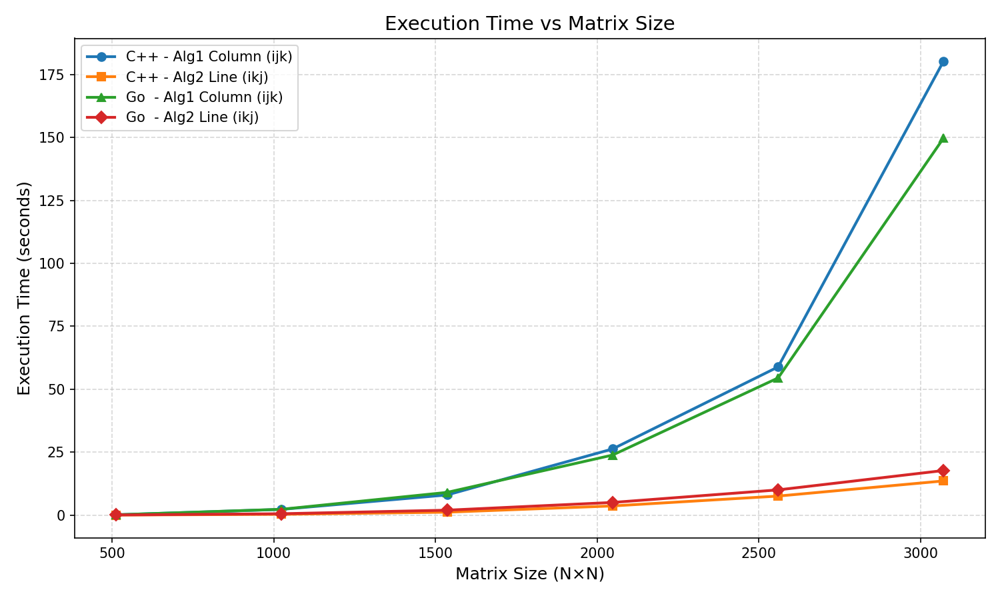
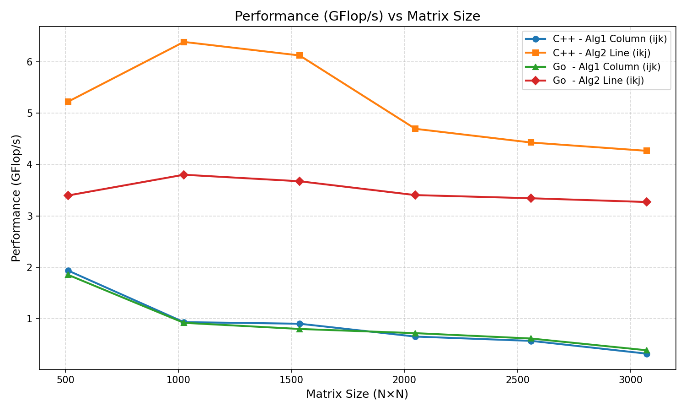
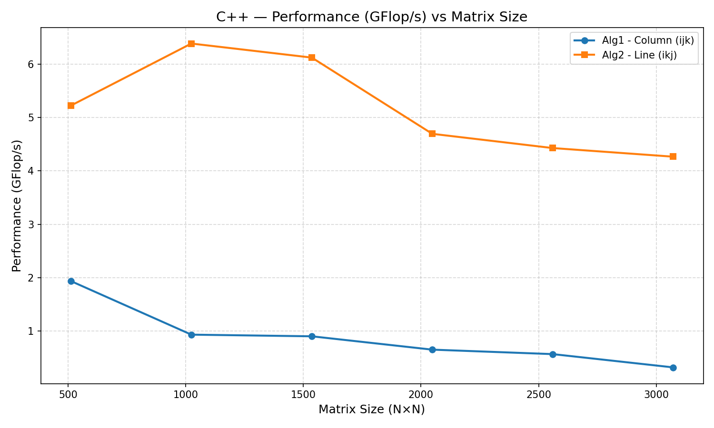

# Graphs for linear algorithms

## Introduction 

This document contains graphs visualizing the execution time of different algorithms for matrix multiplication.

For each algorithm, we measured:
- Size,
- BlockSize,
- Time_Seconds

### Execution Time vs Matrix Size

### GFlop/s vs Matrix Size

### GFlop/s per Language

### Speedup of Algorithm1 vs Algorithm2

### C++ vs Go per Algorithm

